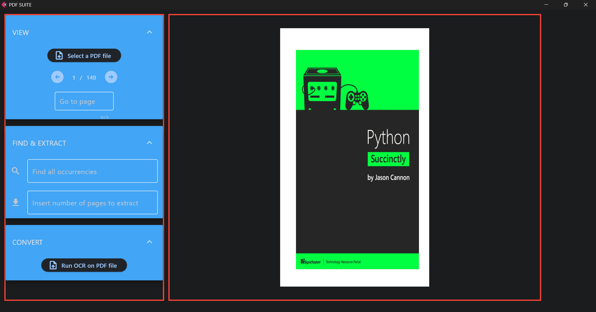

# A PDF_Suite Flet app

A simple app for displaying PDF pages and navigate across them. The app allows to search a keyword across the PDF document and to extract pages from the original doc. Finally, it performs object character recognition (OCR) converting a scanned PDF into a PDF.



UI is organized into two sections: the left one contains widgets and controls, the right section is only intended for displaying PDF pages. 

## View

This section is intended for PDF page displaying. The button allows to select the pdf file while the arrows permit to navigate through the document. Finally, you can directly select the number of the page to display. Page displaying is based on [Pdf2Image library](https://pypi.org/project/pdf2image/).

## Find & Extract

In this section you can search a keyword into the document and extract pages from the original document. If the keyword is present in the document, all its occurrencies are displayed in the textfield below.
Pages extraction functionality saves automatically the selected pages into a pdf stored in the same location of the input pdf file appending the 'extracted' suffix to its file name. These actions are performed with the [Pypdf library](https://pypi.org/project/pypdf/).

## Convert

Last section is dedicated to conversions. The Run OCR button allows to execute an Object Character Recognition to all pages of the document. Converted document is automatically saved in the same folder of the input pdf appending the 'ocr' suffix to its file name. OCR is performed with the [Ocrmypdf library](https://pypi.org/project/ocrmypdf/).

##### To run the app:

```
flet run [app_directory]
flet run --web [app_directory]
```