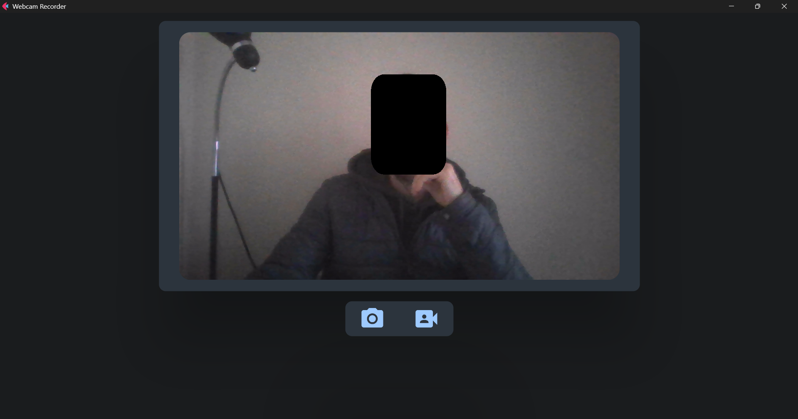

# A Webcam Flet app

The WebcamApp is a *Flet* application that utilizes the `WebcamManager` class to provide a user interface for capturing images and recording video from a webcam.



## Features
- Displays a live feed from the webcam
- Allows users to capture images and save them to a file
- Allows users to record video and save it to a file
- Provides a user interface for controlling the webcam and accessing its features

## Functionality
1. The `WebcamManager` class is initialized and starts capturing video from the webcam.
2. The live feed is displayed in the `ft.Image` control.
3. When the user clicks the "PHOTO" button, the current frame is captured and saved as an image file.
4. When the user clicks the "VIDEO" button, the `WebcamManager` starts recording video to a file.
5. When the user clicks the "VIDEO" button again, the recording stops and the video is saved to a file.
6. The `ft.SnackBar` control displays messages to the user, such as when an image or video has been saved.

## Requirements
- `flet` library for creating the Flet application and controls
- `opencv-python` library for video capture and processing
- `base64` library for encoding images
- `os` library for creating directories and saving files

## Output
- Images are saved as PNG files in the specified output path
- Videos are saved as MP4 files in the specified output path

## Troubleshooting
- If the webcam is not detected, check that the correct index is being used (default is 0).
- If the output directory does not exist, it will be created automatically.


##### To run the app:
```
flet run [app_directory]
```