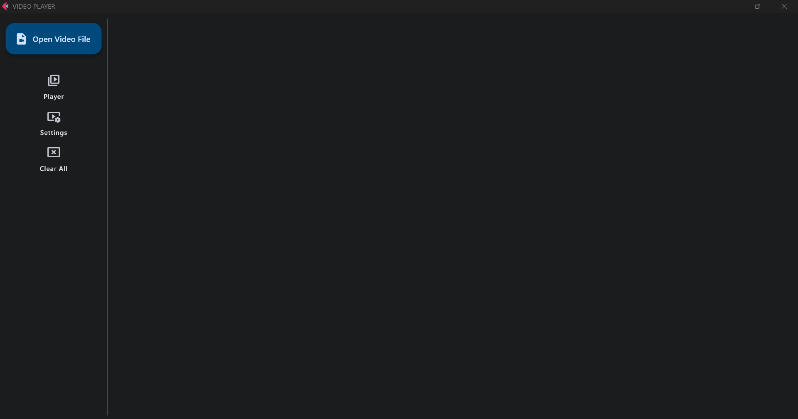

# A Video Player Flet app

A simple video player developed with Flet. The app allows to select one or more video files and to play the video. Moreover, the user can modify some basic settings.



In the left part of the UI, user can open a file dialog for video selection, for video playing and for general settings.

## Open video file

A file dialog for video selection with multiple choices allowed. Only these file extensions are accepted: "mp4", "avi", "mpeg", "mov", "wmv", "mkv", "flv", "f4v", "3gp", "WebM".

## Player

Section in which the video is played. Video player is based on [Flet Video control](https://flet.dev/docs/controls/video/).

## Settings

Settings that users can modify include: autoplay the video, muting the video, video filter quality and video aspect ratio.

## Clear All

All widgets shown in the UI are cleared. Select video files are still kept in memory.


##### To run the app:

```
flet run [app_directory]
flet run --web [app_directory]
```